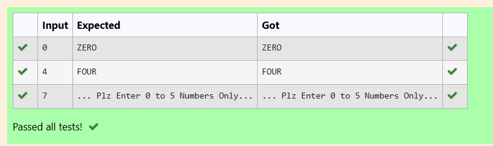
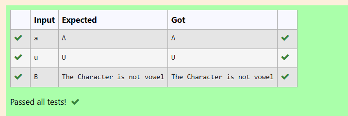

# EX1(B) CONDITIONAL STATEMENTS
Developed by: ARSHITHA MS

Register number: 212223240015
 ## AIM:
 To write a program to print digits into words and to convert lower case vowel letters to upper case letters using the if-else and switch-case respectively.
 ## ALGORITHM:
 1.Start the program

 2.Assign variable of datatype integer to print digits and charecter to change the case.

 3.Get input from the user.

 4.Use if-else and switch-case logics

 5.Print the output.

 ## PROGRAM
 ### Program 1:
 ```
#include<stdio.h>
int main()
{
    int a;
    scanf("%d",&a);
    if (a==0)
    {
        printf("ZERO");
    }
    else if(a==1)
    {
        printf("ONE");
    }
    else if(a==2)
    {
        printf("TWO");
    
    }
    else if(a==3)
    {
        printf("THREE");
    }
    else if(a==4)
    {
        printf("FOUR");
    }
    else if (a==5)
    {
        printf("FIVE");
    }
    else
    {
        printf("... Plz Enter 0 to 5 Numbers Only...");
    }
}
```
### Program 2:
```
#include<stdio.h>
int main()
{
 char choice;

 scanf("%c",&choice);
 
 switch (choice)
 {
     case 'a': printf("A");
     break;
     case 'e': printf("E");
     break;
     case 'i': printf("I");
     break;
     case 'o': printf("O");
     break;
     case 'u': printf("U");
     break;
     default:printf("The Character is not vowel");
 }
}
```

## OUTPUT:
### Output 1:



### Output 2:

## RESULT:
Thus the program to write a program to print digits into words and to convert lower case vowel letters to upper case letters using the if-else and switch-case is executed successfully.